# Procesverslag
Markdown is een simpele manier om HTML te schrijven.  
Markdown cheat cheet: [Hulp bij het schrijven van Markdown](https://github.com/adam-p/markdown-here/wiki/Markdown-Cheatsheet).

Nb. De standaardstructuur en de spartaanse opmaak van de README.md zijn helemaal prima. Het gaat om de inhoud van je procesverslag. Besteedt de tijd voor pracht en praal aan je website.

Nb. Door *open* toe te voegen aan een *details* element kun je deze standaard open zetten. Fijn om dat steeds voor de relevante stuk(ken) te doen.

## Jij

  
uitwerken voor kick-off werkgroep

  ### Auteur:
  Lorenzo Purwanto

  #### Je startniveau:
  Rode piste

  #### Je focus:
  Helemaal responsive
 

## Je website

  
uitwerken voor kick-off werkgroep

  ### Je opdracht:
  Starbucks (https://www.starbucks.com)

  #### Screenshot(s) van de eerste pagina (small screen): 
  Homepagina 
  

  #### Screenshot(s) van de tweede pagina (small screen):
  Menu overzicht 
  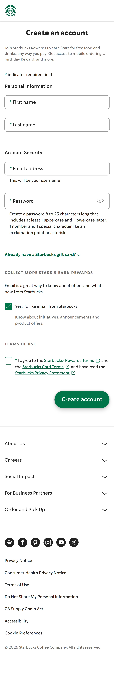
 

## Toegankelijkheidstest 1/2 (week 1)

  
uitwerken na test in 2e werkgroep

  ### Bevindingen
  Lijst met je bevindingen die in de test naar voren kwamen:

  -  **Afbeeldingen**: Alle foto’s hadden een duidelijke en passende alt-tekst, waardoor de inhoud ook voor screenreaders begrijpelijk is.
  - **Koppen**: De koppen waren logisch opgebouwd en goed te volgen.
  - **Contrast**: Het groen-wit contrast is goed leesbaar. Bij sommige lichtere kleuren kan het contrast te laag zijn.
  - **Toetsenbord**: Navigeren met Tab werkt, maar de focus is niet altijd duidelijk zichtbaar.

  - **Conclusie:** Over het algemeen scoorde de website goed op de meeste toegankelijkheidspunten.

## Breakdownschets (week 1)

  
uitwerken na afloop 3e werkgroep

  ### de hele pagina: 
  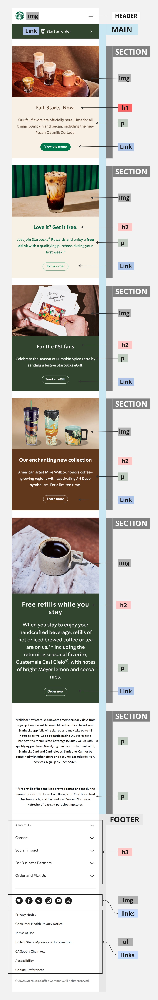

  ### dynamisch deel (bijv menu): 
  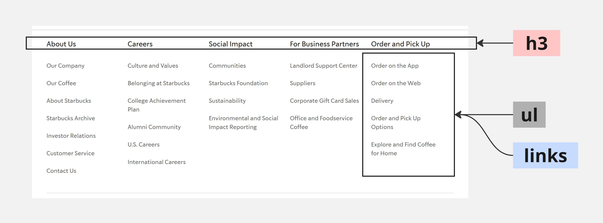

  ### wellicht nog een dynamisch deel (bijv filter): 
  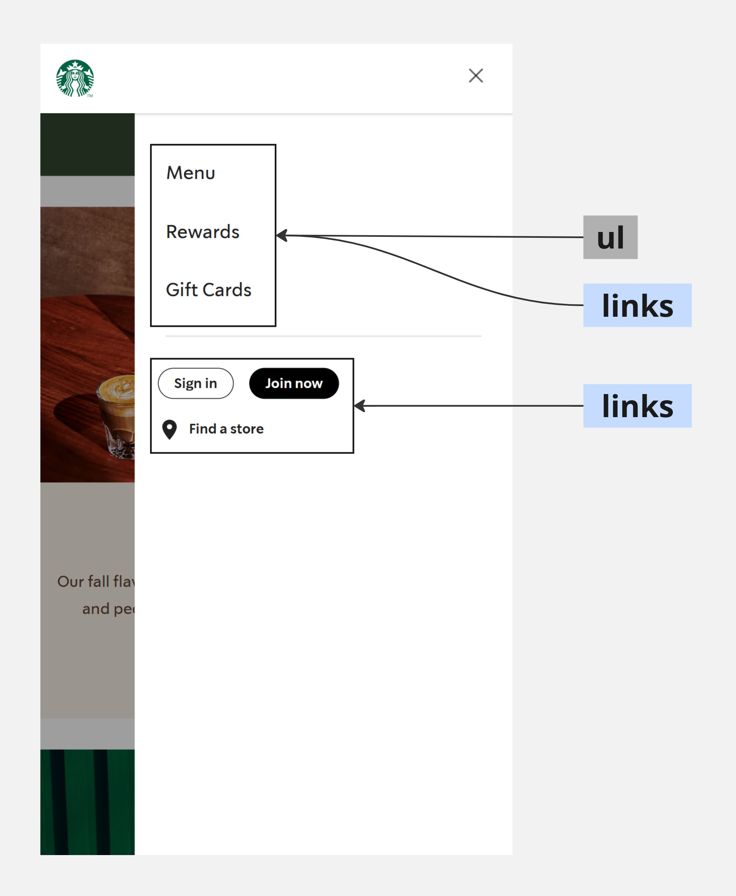

  ### de hele pagina: 
  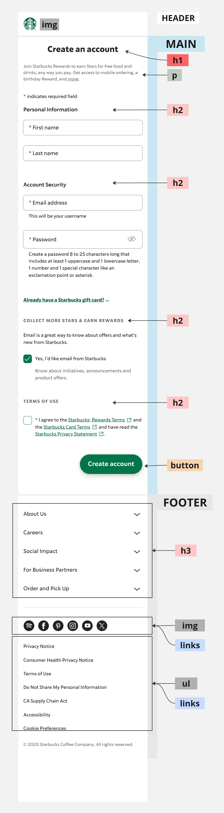

## Voortgang 1 (week 2)

  
uitwerken voor 1e voortgang

  ### Stand van zaken
  Ik ben begonnen met de HTML van de eerste website.  
  Ik zorg er eerst voor dat alle HTML-codes er zo goed mogelijk in staan, zodat ik daarna makkelijker verder kan met de CSS.   

  ### Agenda voor meeting
  samen met je groepje opstellen

  | student 1      | student 2          | student 3    | student 4        |
  | ---            | ---                | ---          | ---              |
  | dit bespreken  | en dit             | en ik dit    | en dan ik dat    |
  | en dat ook nog | dit als er tijd is | nog een punt | dit wil ik zeker |
  | ...            | ...                | ...          | ...              | 

  ### Verslag van meeting
  Ik had de meeting met de studentenassistenten. De meeting ging vrij goed en er werd gekeken hoe ver ik was met mijn werk.  
  Er werd uitgebreid naar mijn breakoutschets gekeken en ik kreeg tips hoe ik bepaalde onderdelen kon coderen.  
  Ook kreeg ik het advies om de breakoutschets nog verder uit te werken en meer onderdelen duidelijker te identificeren met de juiste HTML en CSS tags. Daarnaast werd er naar mijn HTML gekeken en volgens de studentenassistenten was dit een goed begin.

## Voortgang 2 (week 3)

  
uitwerken voor 2e voortgang

  ### Stand van zaken
  Ik heb de lessen gevolgd en de opdrachten die ik nodig heb voor mijn website gedaan. Verder ben ik nog niet zo ver met mijn website. Ik heb een beginnetje gemaakt met mijn CSS maar moet nog goed kijken naar hoe ik de lastige dingen zoals het hamburgermenu moet coderen. 

  ### Agenda voor meeting
  samen met je groepje opstellen

  | student 1      | student 2          | student 3    | student 4        |
  | ---            | ---                | ---          | ---              |
  | dit bespreken  | en dit             | en ik dit    | en dan ik dat    |
  | en dat ook nog | dit als er tijd is | nog een punt | dit wil ik zeker |
  | ...            | ...                | ...          | ...              |

  ### Verslag van meeting
  Deze keer had ik de meeting met de docent. Er werd niet echt naar mijn werk gekeken, maar ik kon wel met mijn vragen komen.  
  Het voelde meer als een klein lesje, waarbij de docent goede en handige uitleg gaf.  
  Ook de vragen van andere studenten in de groep waren nuttig en de uitleg daarbij kon ik goed gebruiken.  
  Dus over het algemeen ging de meeting op zich wel vrij goed.

## Toegankelijkheidstest 2/2 (week 4)

  
uitwerken na test in 9e werkgroep

  ### Bevindingen
  Lijst met je bevindingen die in de test naar voren kwamen (geef ook aan wat er verbeterd is):
  Ik heb eigenlijk opnieuw de toegankelijkheidstest op de officiele website van starbucks gedaan omdat ik de eerste versie kwijt was geraakt. Ik heb deze keer wel wat beter gekeken en zag dat sommige dingen ook niet van toepassing waren. Over het algemeen was de website wel redelijk goed op een paar punten na. Deze heb ik in mijn eigen versie wel verbeterd. Zo heb ik de H1 van de homepagina duidelijker gemaakt, want die gaf op de officiele website niet duidelijk aan op wat voor pagina je was. Verder heb ik elke link een onderlijn gegeven zodra je eroverheen hovert. Ook heb ik de focus via tab duidelijker gemaakt en een skip link toegepast. 

  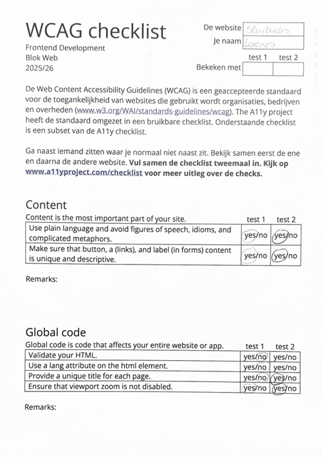
  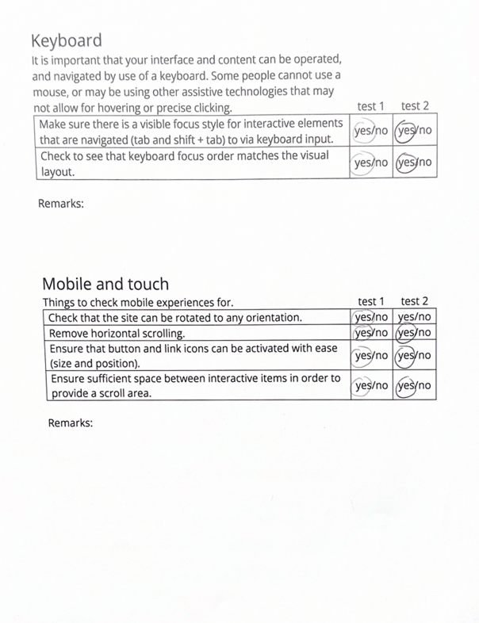
  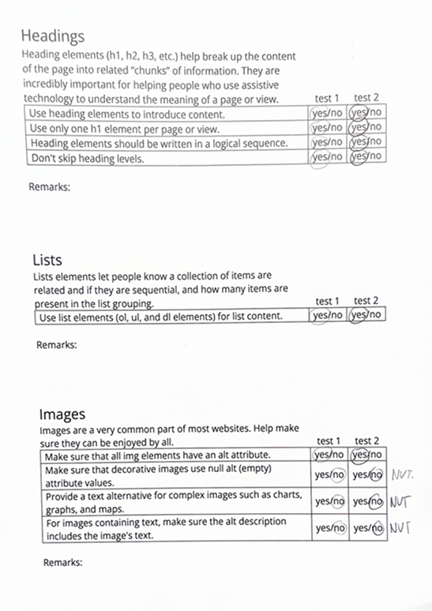
  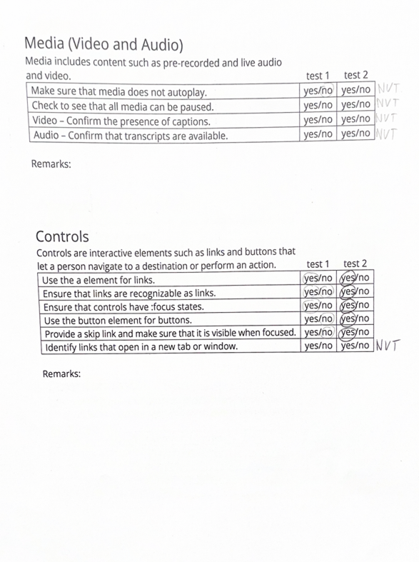
  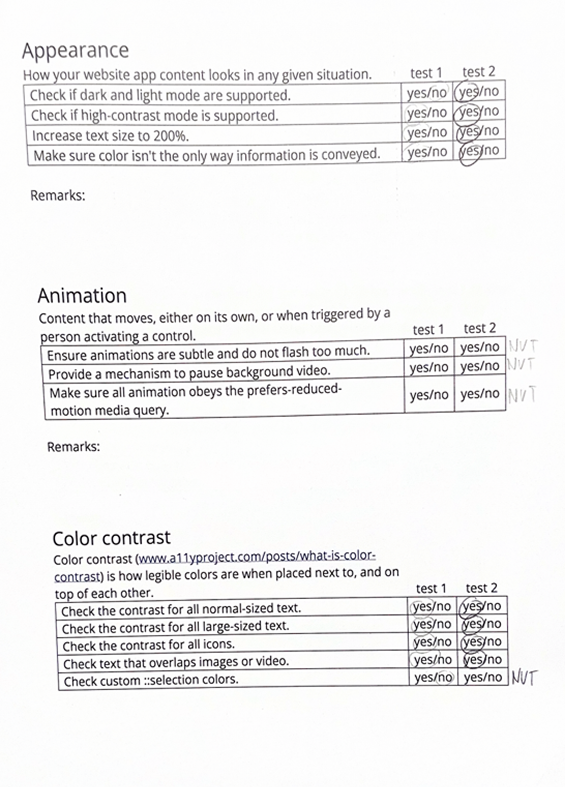

## Voortgang 3 (week 4)

  
uitwerken voor 3e voortgang

  ### Stand van zaken
  Ik had een beginnetje maar mis eigenlijk wel nog redelijk wat codes.

  ### Agenda voor meeting
  samen met je groepje opstellen

  | student 1      | student 2          | student 3    | student 4        |
  | ---            | ---                | ---          | ---              |
  | dit bespreken  | en dit             | en ik dit    | en dan ik dat    |
  | en dat ook nog | dit als er tijd is | nog een punt | dit wil ik zeker |
  | ...            | ...                | ...          | ...              |

  ### Verslag van meeting
  Ik had deze keer weer een gesprek met de studentenassistenten. Ze waren vrij positief, ook al was ik nog niet zo ver met mijn werk. Ik kreeg tips over hoe ik bepaalde dingen kon coderen en ze stuurden ook handige links die mij daarbij konden helpen. Daarnaast gaven ze aan dat mijn README verslag nog wat meer gevuld moest worden, dus dat heb ik nu ook gedaan. Over het algemeen was het een goede meeting.

## Eindgesprek (week 5)

  
uitwerken voor eindgesprek

  ### Je uitkomst - karakteristiek screenshots:
  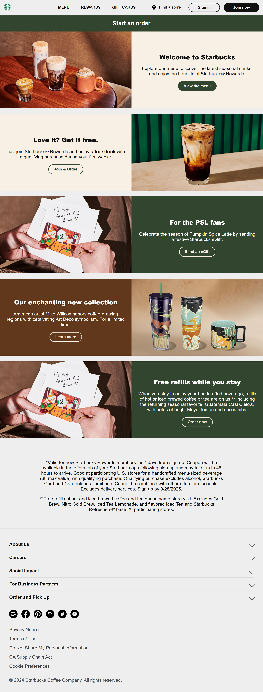
  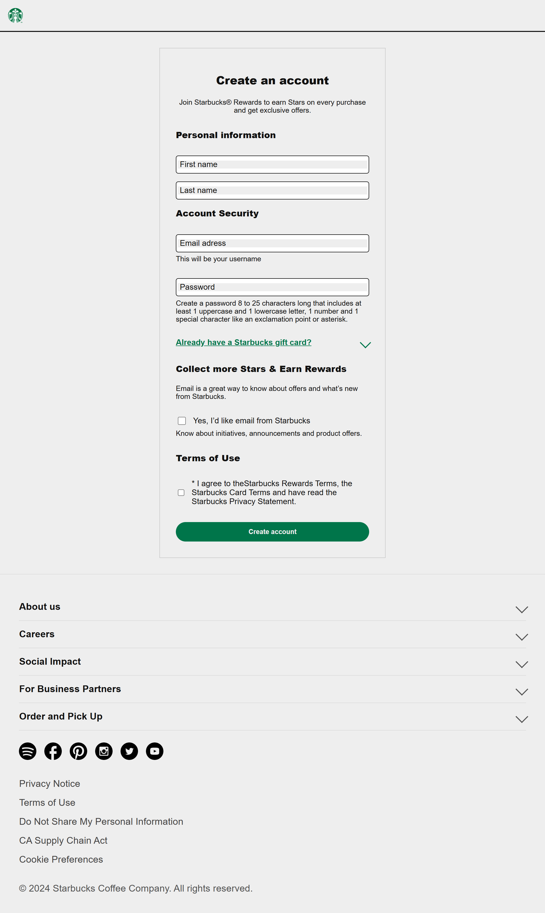

  ### Dit ging goed/Heb ik geleerd: 
  Wat goed ging was het werken met de articles, vooral het selecteren van elk artikel zonder daar classes aan toe te voegen.  
  Ik heb geleerd hoe je met nth-of-type en andere selectors kunt werken.  
  Daarnaast heb ik geleerd om variabelen kleuren toe te passen, om grid goed te gebruiken en hoe je met media queries je website responsive kunt maken.

  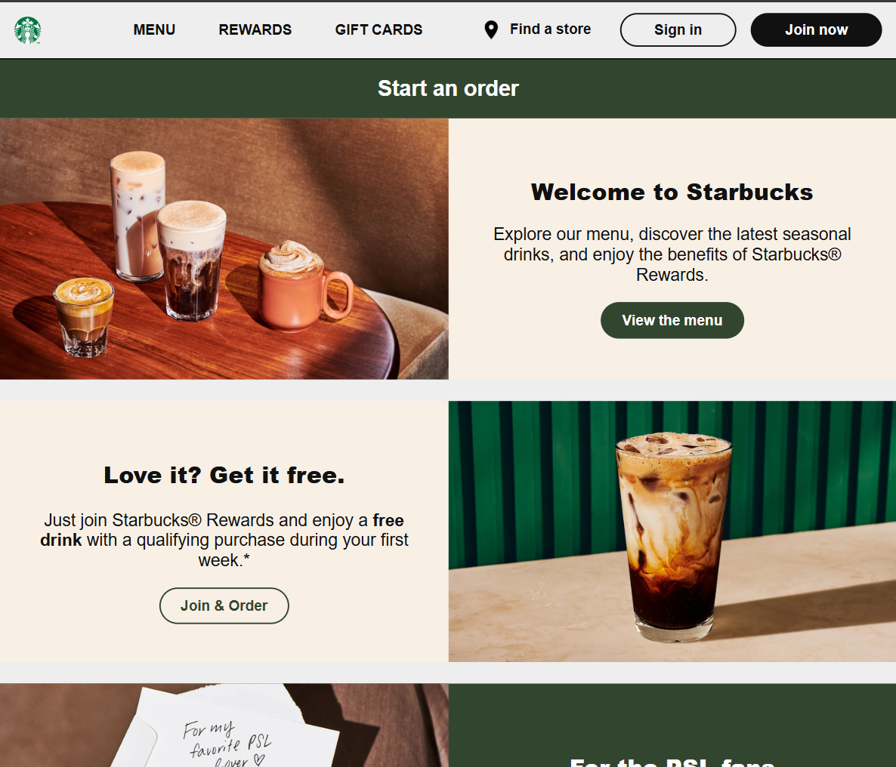

  ### Dit was lastig/Is niet gelukt:
 Wat ik nog lastig vind is het maken van het hamburgermenu.  
Ik heb dit uiteindelijk werkend gekregen met behulp van de uitwerking uit de Codepen opdracht, maar ik vond het wel moeilijk om te begrijpen.  
Daarnaast vond ik het ook lastig om het formulier netjes vorm te geven en hetzelfde geldt voor het gebruik van de details-elementen.  
Ik wil me hier in de toekomst nog verder in verbeteren, omdat ik dit wel coole codes vind om mee te werken.
  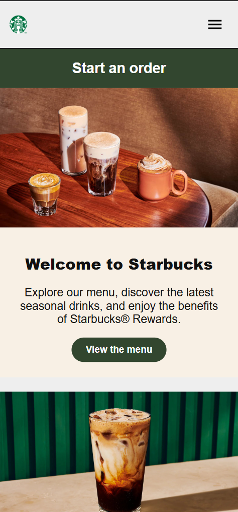
  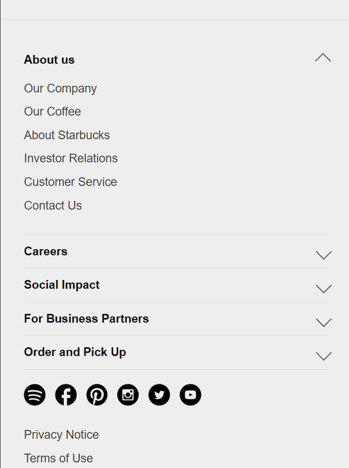
  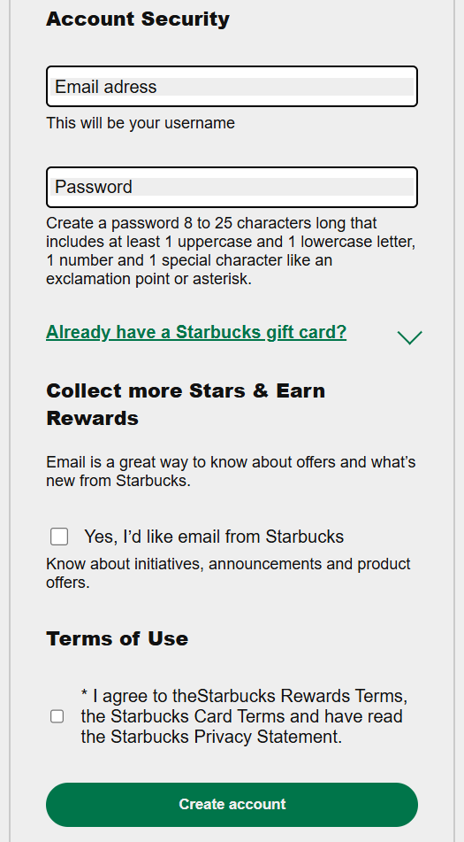

## Bronnenlijst

  
continu bijhouden terwijl je werkt

  1. [bron 1](https://codepen.io/shooft/pen/ByoVYeJ?editors=1100) Voor het maken van de labels (9. onder protest label codes.)
  2. [bron 2](https://codepen.io/shooft/pen/NPGXJGq) Voor het maken van de hamburgermenu (hamburgermenu voorbeeldcodes)
  3. [bron 3](https://developer.mozilla.org/en-US/docs/Web/HTML/Reference/Elements/details) Voor het maken van de detailscodes (details code.)

